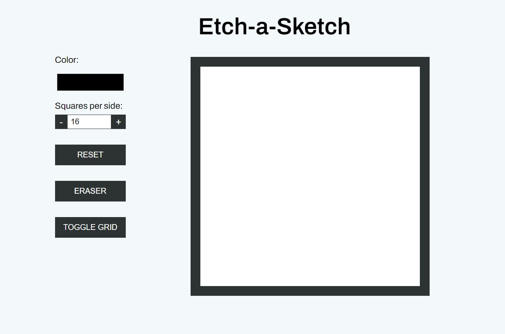
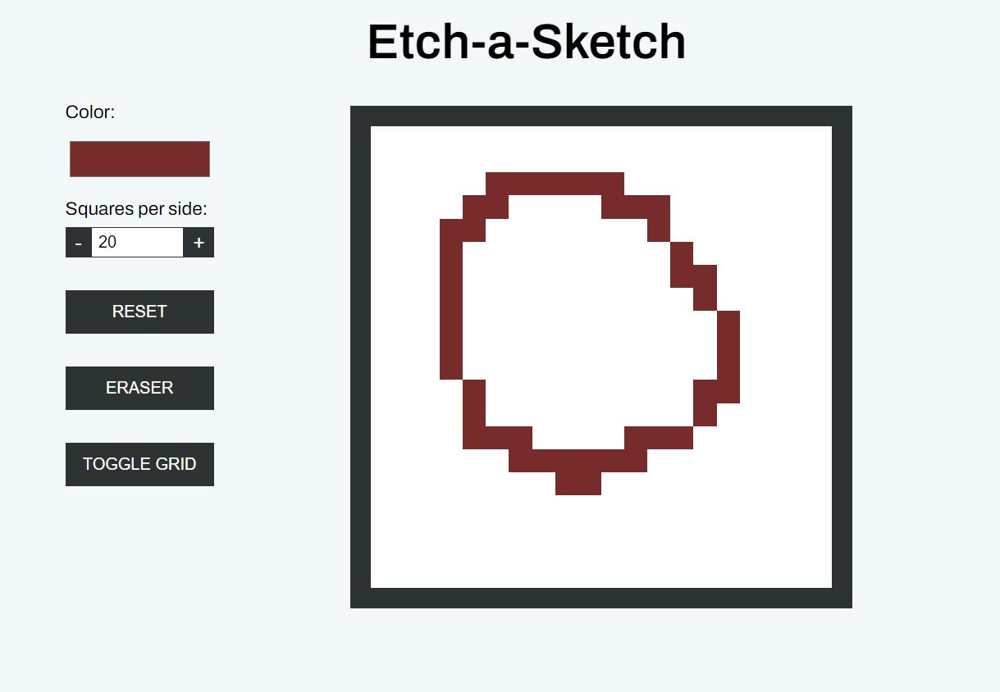

# Etch-a-sketch

This is a solution to [Odin Project - Etch-a-sketch](https://www.theodinproject.com/lessons/foundations-etch-a-sketch)

## Table of contents
- [Overview](#overview)
  - [The challenge](#the-challenge)
  - [Screenshot](#screenshot)
  - [Links](#links)
- [Technologies Used](#technologies-used)
- [Attribution](#attribution)

## Overview
This project is a browser version of something between a sketchpad and an Etch-a-sketch in which user can create pixel art.

### The challenge
This application should have the following functionalities:
- Choose color of drawing pen
- Choose drawing board grid dimensions (e.g. 16x16)
- See drawing grid guidelines if desired
- Erase drawing using pen
- Reset the whole drawing board
- Draw using random colored pen (optional)

## Screenshot

### Links
- Live Site URL: [Live Link](https://hamnaishaq.github.io/etch-a-sketch/)

## Technologies used
- HTML
- CSS
- JS

## Attribution

- Favicon <a href="https://www.flaticon.com/free-icons/pencil" title="pencil icons">pencil icons created by Freepik - Flaticon</a>
